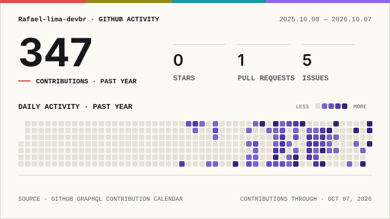

# Rafael Lima Ribeiro dos Santos

### Software Development · Cybersecurity · Robotics · DevSecOps

Technical High School student in **Industrial Automation at IFBA**, interested in building software, security and robotics projects that can be tested, measured and improved.

Estudante do Ensino Médio Técnico em <strong>Automação Industrial no IFBA</strong>, com foco em desenvolvimento de software, cibersegurança, robótica e DevSecOps.

---

## About me

- I build projects involving **software security, phishing detection and secure development**.
- I work with **robotics and autonomous systems**, including line following, PID/PD control, odometry and sensor integration.
- I study and apply **DevSecOps**, with Docker, GitHub Actions, automated testing, SAST/DAST and observability.
- I use **C, C++, Python, Java and JavaScript** across academic, robotics and programming projects.
- I am part of the **FTC programming area at IFBA**, working with the FTC SDK, Java, Git collaboration, Autonomous and TeleOp.

## Areas of focus

**Cybersecurity & Software Security**  
Browser security, phishing detection, application security and secure software development. Main research-oriented project: [`Phishpect`](https://github.com/Rafael-lima-devbr/Phishpect).

**Robotics & Autonomous Systems**  
Arduino and Raspberry Pi projects involving line following, control, odometry, sensors and autonomous navigation.

**DevSecOps**  
CI/CD, containerization, automated testing, security analysis and monitoring. See [`devsecops-task-manager-flask`](https://github.com/Rafael-lima-devbr/devsecops-task-manager-flask).

**Algorithms & Programming**  
Programming exercises, contest solutions and study code organized in [`study-code`](https://github.com/Rafael-lima-devbr/study-code).

## Core stack

`C` · `C++` · `Python` · `Java` · `JavaScript` · `Git` · `GitHub Actions` · `Docker` · `Linux` · `Arduino` · `Raspberry Pi`

## GitHub activity

  Automatically refreshed every day by GitHub Actions. The cards are generated from GitHub data, validated and stored inside this repository before they are shown here.

  <picture>
    <source media="(prefers-color-scheme: dark)" srcset="./profile/overview-card-dark.svg">
    
  </picture>
  &nbsp;
  <picture>
    <source media="(prefers-color-scheme: dark)" srcset="./profile/top-langs-dark.svg">
    
  </picture>

 

  <picture>
    <source media="(prefers-color-scheme: dark)" srcset="./profile/streak-card-dark.svg">
    
  </picture>

Jupyter Notebook is excluded from the language card so generated notebook content does not dominate the source-code breakdown.

<strong>Contribution history</strong>

 

  <picture>
    <source media="(prefers-color-scheme: dark)" srcset="./profile/signal-field-wide-dark.svg">
    
  </picture>

## Connect with me

  Profile metrics automation: <a href=".github/workflows/profile-stats.yml">profile-stats.yml</a>

---

  Building across software, security and robotics.

