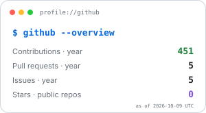
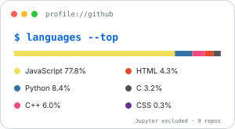
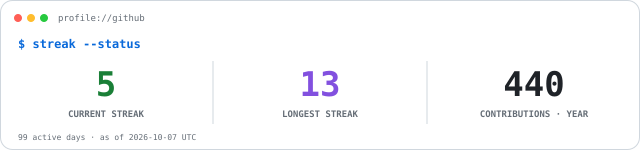
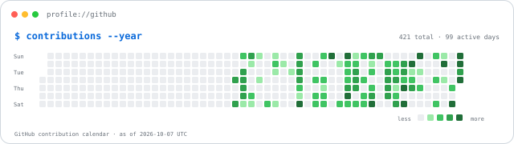

# Rafael Lima Ribeiro dos Santos

### Software Development · Cybersecurity · Robotics · DevSecOps

Technical High School student in **Industrial Automation at IFBA**, building projects across software security, autonomous systems, CI/CD and algorithms.

Estudante do Ensino Médio Técnico em <strong>Automação Industrial no IFBA</strong>, com foco em desenvolvimento de software, cibersegurança, robótica e DevSecOps.

 

<code>// learning by building, testing and improving real projects</code>

---

## Profile

|  |  |
|---|---|
| **Education** | Technical High School in Industrial Automation at **IFBA** |
| **Main areas** | Software development · Cybersecurity · Robotics · DevSecOps |
| **Currently building** | Preventive phishing detection · FTC robotics software · secure CI/CD projects |
| **Programming** | C · C++ · Python · Java · JavaScript |
| **Engineering interests** | Autonomous systems · sensors · control · software security · automation |

I am especially interested in projects where software interacts with something that can be **measured, tested or improved** — whether that is a security signal, a robot, a CI/CD pipeline, a sensor or an algorithmic constraint.

## What I work on

### Cybersecurity & Software Security

I study browser security, phishing detection, application security and secure software development. My main research-oriented project is [`Phishpect`](https://github.com/Rafael-lima-devbr/Phishpect), an experimental browser extension focused on preventive phishing detection.

### Robotics & Autonomous Systems

I work with Arduino and Raspberry Pi projects involving line following, PID/PD control, odometry, sensor integration and autonomous navigation. I also work with **FTC programming at IFBA**, using Java, the FTC SDK, Git collaboration, Autonomous and TeleOp development.

### DevSecOps

I explore CI/CD, containerization, automated testing, SAST/DAST, monitoring and secure pipelines. One of my main projects in this area is [`devsecops-task-manager-flask`](https://github.com/Rafael-lima-devbr/devsecops-task-manager-flask).

### Algorithms & Programming

I keep programming exercises, contest solutions and study code organized in [`study-code`](https://github.com/Rafael-lima-devbr/study-code), mainly using C, C++ and Python.

## Tech stack

<code>// tools I use across software, security and robotics</code>

  
  
  
  
  
  
  
  
  
  
  
  
  
  

C · C++ · Python · Java · JavaScript · Git · GitHub · GitHub Actions · Docker · Linux · Arduino · Raspberry Pi · VS Code · Android Studio

<code>build → test → measure → improve</code>

## GitHub activity

  <code>status: live · refresh: daily</code> 
  Metrics are refreshed automatically <strong>once per day</strong> from GitHub data and stored as validated SVG files inside this repository.

  <picture>
    <source media="(prefers-color-scheme: dark)" srcset="./profile/overview-card-dark.svg">
    
  </picture>
  &nbsp;
  <picture>
    <source media="(prefers-color-scheme: dark)" srcset="./profile/top-langs-dark.svg">
    
  </picture>

 

  <picture>
    <source media="(prefers-color-scheme: dark)" srcset="./profile/streak-card-dark.svg">
    
  </picture>

Jupyter Notebook is intentionally excluded from the language breakdown so notebook metadata does not dominate the source-code profile.

<strong>Contribution map — past year</strong>

 

  <picture>
    <source media="(prefers-color-scheme: dark)" srcset="./profile/contribution-grid-dark.svg">
    
  </picture>

## Connect with me

---

  <code>while (curious) { build(); test(); improve(); }</code>

