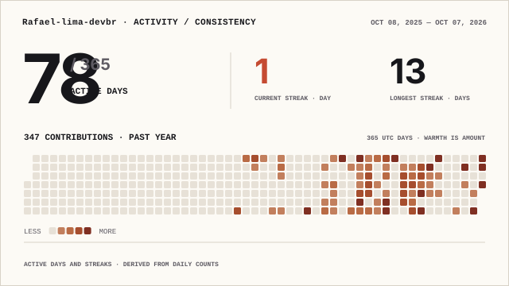

# Rafael Lima Ribeiro dos Santos

**Software Development · Cybersecurity · Robotics · DevSecOps**

Technical High School student in **Industrial Automation at IFBA**, building projects across software security, autonomous systems, CI/CD and algorithms.

Estudante do Ensino Médio Técnico em <strong>Automação Industrial no IFBA</strong>, com foco em desenvolvimento de software, cibersegurança, robótica e DevSecOps.

  

[LinkedIn](https://www.linkedin.com/in/rafael-lima-ribeiro-dos-santos-89b3423a1) · [Email](mailto:rafaelima1250@gmail.com) · [Discord](https://discord.com/users/722159213341704282)

---

## What I build

- **Cybersecurity & software security** — browser security, phishing detection, application security and secure software development. My main research-oriented project is [`Phishpect`](https://github.com/Rafael-lima-devbr/Phishpect).
- **Robotics & autonomous systems** — line following, PID/PD control, odometry, sensor integration and robot navigation using Arduino and Raspberry Pi.
- **DevSecOps** — Docker, GitHub Actions, automated tests, SAST/DAST and observability. See [`devsecops-task-manager-flask`](https://github.com/Rafael-lima-devbr/devsecops-task-manager-flask).
- **Algorithms & programming** — C, C++, Python and competitive-programming exercises organized in [`study-code`](https://github.com/Rafael-lima-devbr/study-code).
- **FTC programming** — working with the FTC SDK, Java, Git-based collaboration and autonomous/TeleOp development at IFBA.

## Core stack

`C` · `C++` · `Python` · `Java` · `JavaScript` · `Git` · `GitHub Actions` · `Docker` · `Linux` · `Arduino` · `Raspberry Pi`

## GitHub activity — live

The metrics below are generated **daily by GitHub Actions from GitHub data** and committed as SVG files inside this repository. They do not rely on a live third-party image endpoint to render when someone opens the profile.

  <picture>
    <source media="(prefers-color-scheme: dark)" srcset="./profile/activity-consistency-wide-dark.svg">
    
  </picture>

 

  <picture>
    <source media="(prefers-color-scheme: dark)" srcset="./profile/top-langs-dark.svg">
    
  </picture>

Jupyter Notebook is intentionally excluded from the language card so notebook metadata and outputs do not dominate the source-code breakdown.

<strong>More GitHub activity</strong>

 

  <picture>
    <source media="(prefers-color-scheme: dark)" srcset="./profile/signal-field-wide-dark.svg">
    
  </picture>

  Automation: <a href=".github/workflows/profile-stats.yml">profile-stats.yml</a> · generated files are validated before publication.

---

  Building across software, security and robotics — with an emphasis on projects that can be tested, measured and improved.

